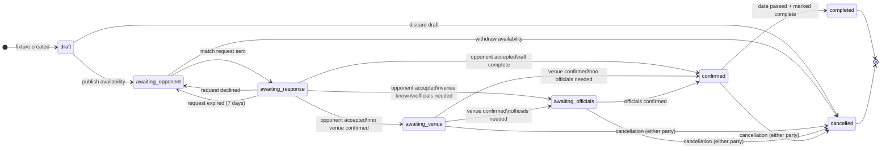

# 01 — Fixture State Machine

**Version:** 1.0  
**Date:** 2026-04-19  
**Owner:** Agent 2 (Domain Model & Logic)  
**Status:** Draft — awaiting Agent 9 review

---

## 1. States

| State | User-facing label | Description |
|---|---|---|
| `draft` | *(not visible externally)* | Record created but availability not published. Used for pre-planned or imported league fixtures. |
| `awaiting_opponent` | Awaiting opponent | Availability published; visible in search results; no confirmed opponent. |
| `awaiting_response` | Awaiting response | Match request sent to a specific team; waiting for accept or decline; availability locked for other requesters. |
| `awaiting_venue` | Awaiting venue | Opponent confirmed; venue not confirmed. |
| `awaiting_officials` | Awaiting officials | Opponent and venue confirmed; required officials (umpire, scorer) not confirmed. |
| `confirmed` | Confirmed | All required parties confirmed. |
| `completed` | Completed | Fixture date has passed and the Fixture Manager has marked it complete. |
| `cancelled` | Cancelled | Fixture explicitly cancelled before being played. |

**Terminal states:** `completed`, `cancelled`

**Note on partial gaps:** A fixture can have both venue and officials missing after opponent confirmation. The displayed state follows priority order: `awaiting_venue` before `awaiting_officials`. Both flags are tracked independently on the fixture record; transitions fire when the highest-priority gap is resolved.

---

## 2. State Diagram

### Plain-English Walkthrough

1. A Fixture Manager creates a fixture record for a date (draft).
2. They publish it as availability — the fixture enters `awaiting_opponent` and appears in search.
3. Another team finds it and sends a match request — fixture moves to `awaiting_response`. The availability is locked so no other teams can request it while the response is pending.
4. If the receiving team declines or the 7-day expiry fires, the fixture returns to `awaiting_opponent` and availability is unlocked.
5. If the receiving team accepts:
   - If no venue is confirmed → `awaiting_venue`
   - If venue is known but officials are required and not confirmed → `awaiting_officials`
   - If everything is in place → `confirmed`
6. From `awaiting_venue`, confirming a venue moves to `awaiting_officials` (if officials needed) or `confirmed`.
7. From `awaiting_officials`, confirming officials moves to `confirmed`.
8. On the fixture date, after the game is played, the Fixture Manager marks it complete → `completed`.
9. Any party may cancel from any non-terminal state; the transition to `cancelled` has different conditions by state (see §3).

---

## 3. Transitions

### T01: Publish availability

| Attribute | Value |
|---|---|
| From | `draft` |
| To | `awaiting_opponent` |
| Trigger | Fixture Manager submits published availability |
| Permission | Fixture Manager of the team |
| Pre-conditions | Fixture has: date (or date window), format, home/away preference, tier |
| Post-conditions | Fixture is visible in search; `availability.published_at` set |
| Side effects | None |

---

### T02: Send match request

| Attribute | Value |
|---|---|
| From | `awaiting_opponent` |
| To | `awaiting_response` |
| Trigger | Fixture Manager sends match request to a specific team |
| Permission | Fixture Manager of the requesting team |
| Pre-conditions | Requesting team has no active match request for this fixture; neither team has blocked the other |
| Post-conditions | `match_request` record created; availability locked to this request; receiving team notified |
| Side effects | If receiving team has their own published availability for this date, it is placed in a `pending` lock state. Notification: `MATCH_REQUEST_RECEIVED` sent to receiving team's Fixture Manager. |

---

### T03: Request declined

| Attribute | Value |
|---|---|
| From | `awaiting_response` |
| To | `awaiting_opponent` |
| Trigger | Receiving Fixture Manager explicitly declines |
| Permission | Fixture Manager of the receiving team |
| Pre-conditions | Match request in `pending` state |
| Post-conditions | `match_request.status = declined`; availability unlocked; receiving team's own availability (if locked) unlocked |
| Side effects | Notification: `MATCH_REQUEST_DECLINED` to sending team's Fixture Manager. No trust penalty. |

---

### T04: Request expired

| Attribute | Value |
|---|---|
| From | `awaiting_response` |
| To | `awaiting_opponent` |
| Trigger | System: 7 days elapsed since `match_request.sent_at` with no response |
| Permission | System (automated) |
| Pre-conditions | `match_request.status = pending` AND `now > sent_at + 7 days` |
| Post-conditions | `match_request.status = expired`; availability unlocked; sending team notified |
| Side effects | Notification: `MATCH_REQUEST_EXPIRED` to sending team's Fixture Manager. Receiving team's non-response is flagged internally as a response-rate data point. |

---

### T05: Request accepted (no venue)

| Attribute | Value |
|---|---|
| From | `awaiting_response` |
| To | `awaiting_venue` |
| Trigger | Receiving Fixture Manager accepts the match request |
| Permission | Fixture Manager of the receiving team |
| Pre-conditions | Fixture has no confirmed venue |
| Post-conditions | `match_request.status = accepted`; fixture links both teams; venue gap flagged |
| Side effects | Receiving team's own availability for this date closed. Both teams' Fixture Managers notified: `MATCH_CONFIRMED`. "What's missing" panel shows venue gap. |

---

### T06: Request accepted (venue known, officials needed)

| Attribute | Value |
|---|---|
| From | `awaiting_response` |
| To | `awaiting_officials` |
| Trigger | Receiving Fixture Manager accepts |
| Permission | Fixture Manager of the receiving team |
| Pre-conditions | Venue confirmed on fixture; `officials_required = true`; no officials confirmed |
| Post-conditions | `match_request.status = accepted`; officials gap flagged |
| Side effects | As T05. "What's missing" panel shows officials gap. |

---

### T07: Request accepted (all complete)

| Attribute | Value |
|---|---|
| From | `awaiting_response` |
| To | `confirmed` |
| Trigger | Receiving Fixture Manager accepts |
| Permission | Fixture Manager of the receiving team |
| Pre-conditions | Venue confirmed; either `officials_required = false` or officials confirmed |
| Post-conditions | `match_request.status = accepted`; fixture fully confirmed |
| Side effects | Both Fixture Managers notified: `FIXTURE_CONFIRMED`. |

---

### T08: Venue confirmed

| Attribute | Value |
|---|---|
| From | `awaiting_venue` |
| To | `awaiting_officials` OR `confirmed` |
| Trigger | Either Fixture Manager confirms the venue |
| Permission | Fixture Manager of either team; Club Admin |
| Pre-conditions | Fixture in `awaiting_venue`; venue record attached |
| Post-conditions | `fixture.venue_id` set; `venue_confirmed = true` |
| Side effects | If `officials_required = false` or officials already confirmed → transition to `confirmed`. Else → `awaiting_officials`. Both Fixture Managers notified: `VENUE_CONFIRMED`. |

---

### T09: Officials confirmed

| Attribute | Value |
|---|---|
| From | `awaiting_officials` |
| To | `confirmed` |
| Trigger | Umpire (or scorer) accepts support request |
| Permission | Service provider (umpire/scorer) |
| Pre-conditions | Support request accepted by the required official(s) |
| Post-conditions | `fixture.umpire_id` (and/or `scorer_id`) set; `officials_confirmed = true` |
| Side effects | Transition to `confirmed` only when all required officials confirmed. Notification: `OFFICIALS_CONFIRMED` to both Fixture Managers. |

---

### T10: Marked complete

| Attribute | Value |
|---|---|
| From | `confirmed` |
| To | `completed` |
| Trigger | Fixture Manager marks fixture complete after the date passes |
| Permission | Fixture Manager of either team |
| Pre-conditions | `fixture.date < now` |
| Post-conditions | `fixture.status = completed`; `fixture.completed_at` set |
| Side effects | Review prompt triggered for both Fixture Managers: `REVIEW_PROMPT`. Review window: 7 days from `completed_at`. |

---

### T11: Cancellation — > 48 hours before fixture

| Attribute | Value |
|---|---|
| From | `awaiting_venue`, `awaiting_officials`, `confirmed` |
| To | `cancelled` |
| Trigger | Either Fixture Manager cancels |
| Permission | Fixture Manager of either team |
| Pre-conditions | `fixture.date - now > 48 hours` |
| Post-conditions | `fixture.status = cancelled`; `cancellation.reason` recorded; `cancellation.notice_hours` recorded |
| Side effects | Both teams notified: `FIXTURE_CANCELLED`. Availability is NOT automatically reposted — Fixture Manager must re-publish manually. No trust penalty applied. |

---

### T12: Cancellation — < 48 hours before fixture (short-notice)

| Attribute | Value |
|---|---|
| From | `awaiting_venue`, `awaiting_officials`, `confirmed` |
| To | `cancelled` |
| Trigger | Either Fixture Manager cancels |
| Permission | Fixture Manager of either team |
| Pre-conditions | `fixture.date - now ≤ 48 hours` |
| Post-conditions | `fixture.status = cancelled`; `cancellation.short_notice = true`; `cancellation.initiating_team_id` set |
| Side effects | Both teams notified: `FIXTURE_CANCELLED_SHORT_NOTICE`. A synthetic review with scores [0, 0, 0] is injected for the cancelling team's trust record (see `05-trust-algorithm.md`). The receiving team may optionally submit a review. Internal "Needs attention" flag reviewed by moderation if club accumulates ≥2 short-notice cancellations in a season. |

---

### T13: Cancellation from `awaiting_opponent`

| Attribute | Value |
|---|---|
| From | `awaiting_opponent` |
| To | `cancelled` |
| Trigger | Fixture Manager withdraws availability |
| Permission | Fixture Manager of the publishing team |
| Pre-conditions | No active match request (would be in `awaiting_response`) |
| Post-conditions | `fixture.status = cancelled`; availability removed from search |
| Side effects | No notifications (no other party yet confirmed). No trust impact. |

---

### T14: Cancellation from `awaiting_response`

| Attribute | Value |
|---|---|
| From | `awaiting_response` |
| To | `cancelled` |
| Trigger | Sending Fixture Manager withdraws the request before response |
| Permission | Fixture Manager of the sending team |
| Pre-conditions | `match_request.status = pending` |
| Post-conditions | `fixture.status = cancelled`; `match_request.status = withdrawn`; receiving team's availability unlocked |
| Side effects | Receiving team notified: `MATCH_REQUEST_WITHDRAWN`. No trust penalty. |

---

### T15: Weather cancellation (mutual)

| Attribute | Value |
|---|---|
| From | `confirmed` |
| To | `cancelled` |
| Trigger | Either Fixture Manager marks as weather cancellation within 48-hour window |
| Permission | Fixture Manager of either team |
| Pre-conditions | `fixture.date - now ≤ 48 hours`; `cancellation.reason = weather` |
| Post-conditions | `fixture.status = cancelled`; `cancellation.reason = weather`; `cancellation.short_notice = true` but `cancellation.weather = true` |
| Side effects | Both teams notified: `FIXTURE_CANCELLED_WEATHER`. No synthetic review penalty for weather cancellations (weather flag suppresses the trust injection). Manual review still optionally available. |

---

## 4. Invariants

These conditions must hold at all times:

1. A fixture in `awaiting_response` has exactly one `pending` match request.
2. A fixture cannot have more than one `pending` match request at a time.
3. A fixture cannot be in `confirmed` without `venue_confirmed = true` and (either `officials_required = false` or `officials_confirmed = true`).
4. A `completed` fixture must have `fixture.date < fixture.completed_at`.
5. A `cancelled` fixture records `cancellation.initiating_team_id` and `cancellation.notice_hours`.
6. Only one review per team per fixture may be submitted; reviews cannot be edited after submission.

---

## 5. State from the receiving team's perspective

When Club B receives a match request from Club A:

| Event | Effect on Club B's state |
|---|---|
| Request received | Club B's availability for that date is locked (`pending`). Club B cannot accept another request for that date while this one is pending. |
| Club B accepts | Club B's availability for that date is closed (`filled`). A fixture record is created for Club B linked to the same game. |
| Club B declines | Club B's availability for that date is unlocked. Club B remains in `awaiting_opponent` for that date. |
| Request expires | Same as decline. |

---

## 6. Worked Examples

### Example A: Standard flow — match confirmed without venue gap

**Scenario:** Thornton CC 1st XI posts availability for 14 June (T20, home). Redfield CC 2nd XI finds it and sends a match request.

| Step | Fixture state | Event |
|---|---|---|
| 1 | `draft` | Thornton creates fixture for 14 June at home ground |
| 2 | `awaiting_opponent` | Thornton publishes availability |
| 3 | `awaiting_response` | Redfield sends match request |
| 4 | `confirmed` | Thornton's Fixture Manager accepts; venue is Thornton's home ground (already confirmed); no officials required (friendly) |
| 5 | `completed` | 15 June: Thornton's FM marks fixture complete |

**Why correct:** Thornton's home ground is known at fixture creation, so `venue_confirmed = true` at acceptance. Friendly format has `officials_required = false`. All conditions for `confirmed` are met immediately on acceptance → T07 fires.

---

### Example B: Request expires, availability relisted

**Scenario:** Merton CC posts availability for 7 July. Oldwick CC sends a request but does not respond for 7 days.

| Step | Fixture state | Event |
|---|---|---|
| 1 | `awaiting_opponent` | Merton publishes availability |
| 2 | `awaiting_response` | Oldwick sends match request (28 June) |
| 3 | `awaiting_opponent` | 5 July: system fires T04 (7-day expiry) |
| 4 | `awaiting_response` | Merton sends request to Southbury CC |
| 5 | `confirmed` | Southbury accepts |

**Why correct:** T04 fires because 7 days elapsed without Oldwick responding. Oldwick's non-response is logged as a response-rate data point (does not affect trust score, only search ranking). Merton's availability is unlocked and visible again immediately.

---

### Example C: Short-notice cancellation trust injection

**Scenario:** Hartwell CC cancels a confirmed fixture 20 hours before match day.

| Step | Fixture state | Event |
|---|---|---|
| 1 | `confirmed` | Fixture scheduled for Saturday |
| 2 | `cancelled` | Friday afternoon: Hartwell's FM cancels |
| 3 | *(trust record)* | Synthetic review [0, 0, 0] injected for Hartwell |
| 4 | *(notification)* | Opposing team receives `FIXTURE_CANCELLED_SHORT_NOTICE` |

**Why correct:** `fixture.date - now = 20 hours < 48 hours` → T12 fires. Weather flag is false (Hartwell initiated, not weather). Synthetic review penalty applies to Hartwell's trust record. Opposing team receives no trust penalty.

---

### Example D: Weather cancellation — no penalty

**Scenario:** Both teams agree to cancel due to a waterlogged pitch 6 hours before start.

| Step | Fixture state | Event |
|---|---|---|
| 1 | `confirmed` | Fixture scheduled for Sunday |
| 2 | `cancelled` | Sunday morning: Fixture Manager marks as weather cancellation |

**Why correct:** `cancellation.reason = weather` suppresses the synthetic trust penalty (T15). No team is penalised. Both receive `FIXTURE_CANCELLED_WEATHER` notification.

---

### Example E: Partial fill — venue then officials

**Scenario:** Away fixture; venue confirmation is awaited (opponent's home ground under discussion); umpire required.

| Step | Fixture state | Event |
|---|---|---|
| 1 | `awaiting_response` | Match request sent; both teams aware officials are needed |
| 2 | `awaiting_venue` | Opponent accepts; `venue_confirmed = false`, `officials_required = true` |
| 3 | `awaiting_officials` | Opponent confirms their home ground as venue |
| 4 | `confirmed` | Home team's rostered umpire accepts support request |

**Why correct:** Transitions follow priority order. Venue gap resolved first (T08 → `awaiting_officials`), then officials confirmed (T09 → `confirmed`).
