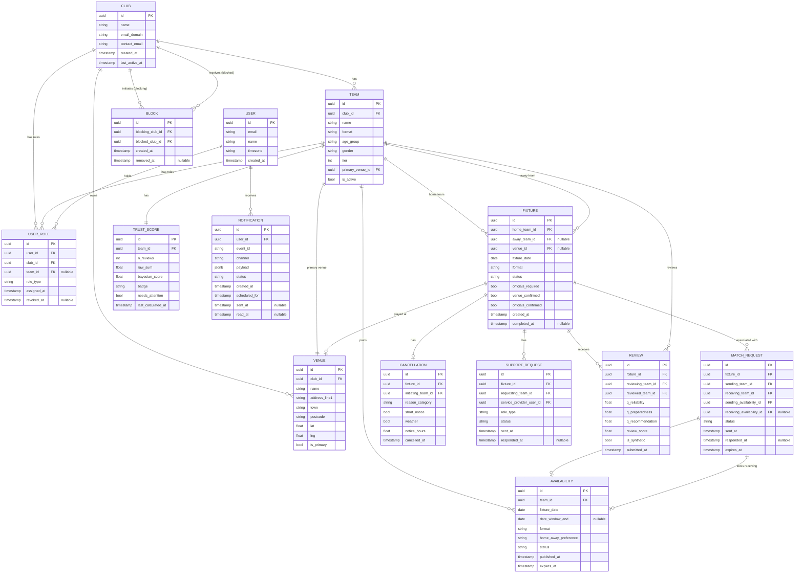

# 08 — Data Model

**Version:** 1.0  
**Date:** 2026-04-19  
**Owner:** Agent 2 (Domain Model & Logic)  
**Status:** Draft — requires Agent 9 (Engineering) review before finalisation

---

## 1. Entity Relationship Diagram

---

## 2. Plain-English Walkthrough

The data model is anchored by three core concepts:

1. **Organisation** — A `Club` owns `Team`s and `Venue`s. `User`s are linked to clubs and teams via `UserRole`, which records their current role (Club Admin, Fixture Manager, Captain, Service Provider) and when it was assigned or revoked.

2. **Coordination** — An `Availability` is a team's published intent to play on a given date. A `MatchRequest` connects two availability records (one per team) and, when accepted, creates or updates a `Fixture`. A `Fixture` accretes state: it tracks which parties are confirmed (venue, officials) and transitions through statuses per the state machine in `01-fixture-state-machine.md`.

3. **Trust** — Every completed `Fixture` can generate `Review`s. Reviews aggregate into a `TrustScore` per team. A `Block` is a club-to-club silence that affects search visibility and match request routing.

---

## 3. Entity Descriptions

### Club

The top-level organisation. One Club has one or more Teams. Trust operates at the team level, not club level (so a club's 1st XI and 2nd XI have independent trust records). The `email_domain` field supports duplicate registration detection (see `05-trust-algorithm.md` gaming analysis, Attack 4).

### Venue

A physical ground, owned by a Club. A Team has a `primary_venue_id` (can be null if the team plays away only or hasn't set it). A Fixture has a `venue_id` (the specific ground for that game, can be null until confirmed).

### Team

The unit that posts availability, sends requests, and accumulates trust. Attributes include format, age group, gender, and tier — these drive the matching algorithm in `04-matching-algorithm.md`. A team may be active or inactive (`is_active = false` for disbanded teams; their historical fixtures are retained).

### User

A person with a platform account. Users are not publicly visible by name — only their role within a club is relevant to other users. A user may hold multiple roles across multiple clubs (represented as multiple `UserRole` rows).

### UserRole

Junction table connecting a User to a Club (and optionally a specific Team) with a role type. A role is active if `revoked_at` is null. Historical roles are retained for audit purposes; `revoked_at` is set when the role ends.

| role_type values | Scope |
|---|---|
| `club_admin` | club_id set; team_id null |
| `fixture_manager` | both club_id and team_id set |
| `captain` | both club_id and team_id set |
| `service_provider` | club_id set; team_id null (available to any team in the club) |

### Availability

A published intent to play. A team may have multiple availability records (e.g., if they can play on multiple dates in the same week). Status values: `active`, `locked` (pending match request), `filled` (opponent confirmed), `expired`, `withdrawn`.

`date_window_end` is null if the availability is for a single specific date. If set, it represents a flexible window (e.g., "any Saturday in June").

### Fixture

The central coordination record. Tracks which teams are involved, which venue is confirmed, and which officials are confirmed. The `status` field reflects the state machine in `01-fixture-state-machine.md`. The fixture record persists after completion or cancellation; it is never deleted (audit trail).

### MatchRequest

Links a sending team's availability to a receiving team (and optionally their availability). Status values: `pending`, `accepted`, `declined`, `expired`, `withdrawn`.

When a match request is `pending`, the sending team's availability status is set to `locked`. When accepted: availability set to `filled`. When declined/expired/withdrawn: availability returns to `active`.

### Cancellation

Created when a fixture is cancelled. Stores enough metadata to determine the trust implications (short_notice, weather) and to display the correct notification template. The `reason_category` is an internal taxonomy (not shown to opposing team); the `notice_hours` field enables precise calculation of the short-notice threshold.

### SupportRequest

A request to a rostered service provider for a specific fixture. In MVP: umpires only. `role_type` values: `umpire`, `scorer` (reserved). Status values: `pending`, `accepted`, `declined`.

### Review

A post-match review submitted by one team about the opposing team. `is_synthetic = true` for system-injected short-notice cancellation reviews. The three question scores (`q_reliability`, `q_preparedness`, `q_recommendation`) are stored individually to allow future analysis of which dimension predicts behaviour best.

**Privacy note:** Reviews must never be queryable by the reviewed team in a way that reveals the reviewing team's identity. The `reviewing_team_id` is stored for audit and fraud detection (one review per fixture per team pair) but is never exposed via any API endpoint to the reviewed club.

### TrustScore

A materialised (pre-computed) record updated after each review is submitted. This avoids computing the Bayesian score on every search query. `last_calculated_at` allows cache invalidation if the algorithm changes. When the algorithm is updated, a migration recalculates all trust scores.

### Block

A directional club-to-club block. The `removed_at` field is set when the block is lifted; the record is not deleted (audit trail). An active block has `removed_at = null`.

### Notification

Log of all notifications sent or scheduled. `payload` is a JSON object containing the template variables (see `06-notification-matrix.md`). `status` values: `pending`, `scheduled`, `sent`, `failed`, `read`. Notifications are never deleted; they are retained for support and debugging.

---

## 4. Relationships and Cardinality

| Relationship | Cardinality | Notes |
|---|---|---|
| Club → Team | 1 to many | A club has 1+ teams |
| Club → Venue | 1 to many | A club owns 0+ venues |
| Club → UserRole | 1 to many | Multiple roles per club |
| Team → Availability | 1 to many | Multiple availability records per team |
| Team → Fixture (home) | 1 to many | A team can be home team on many fixtures |
| Team → Fixture (away) | 1 to many | A team can be away team on many fixtures |
| Fixture → MatchRequest | 1 to many | Multiple requests may have been made (most declined/expired) before one accepted |
| Fixture → Review | 1 to 2 | Maximum two reviews per fixture (one from each team) |
| Team → TrustScore | 1 to 1 | Each team has exactly one TrustScore record |
| Club → Block (as blocker) | 1 to many | A club may block many others |
| Club → Block (as blocked) | 1 to many | A club may be blocked by many others |

---

## 5. Sensitive Data Notes

| Data | Sensitivity | Handling |
|---|---|---|
| Review question scores | High — linked to specific clubs | Stored in Review table; `reviewing_team_id` never exposed in client APIs. Accessible to platform moderation only. |
| Block records | Medium — block existence is private | `Block` table not queryable by blocked club. API returns "not available" without disclosing block. |
| Trust scores (numeric) | Medium — internal only | `TrustScore.bayesian_score` never exposed to external API. Only `badge` field is returned. |
| User emails | Standard PII | Stored in User table; used only for notifications. Not shared between clubs. |
| Cancellation reasons | Low — internal taxonomy | `reason_category` is for internal analytics. Not exposed to opposing team via API. |
| UserRole history (revoked roles) | Low | Retained for audit; not queryable by other clubs. |

---

## 6. Indexing Hints for Matching Queries

The matching algorithm's hot path is: given a searcher, find all `Availability` records that pass hard filters, ordered by composite score.

Required indexes (to be confirmed by Agent 9):

| Table | Index | Query pattern |
|---|---|---|
| `availability` | `(status, fixture_date)` | Filter active availability by date |
| `availability` | `(team_id, fixture_date, status)` | Check if team already has availability for date |
| `team` | `(format, age_group, gender, tier)` | Format/compatibility filter |
| `venue` | `(lat, lng)` | Distance calculation (PostGIS extension likely required for spatial indexing) |
| `block` | `(blocking_club_id, blocked_club_id, removed_at)` | Block filter; partial index on `removed_at IS NULL` |
| `match_request` | `(fixture_id, status)` | Check for pending requests on an availability |
| `trust_score` | `(team_id)` | Look up trust score per team |
| `review` | `(reviewed_team_id, is_synthetic)` | Aggregate review scores per team |

**Note for Agent 9:** The distance calculation for matching is the most performance-sensitive part of the query. With potentially tens of thousands of availability records, a geospatial index (PostGIS `geography` type or equivalent) is strongly recommended over a calculated haversine distance in application code. The matching query should filter by bounding box first (lat/lng range) before calculating exact distances.

---

## 7. Data Retention

| Entity | Retention policy |
|---|---|
| Fixture (completed) | Indefinite — historical record |
| Fixture (cancelled) | Indefinite — needed for trust calculation audit |
| Review | Indefinite — trust record depends on it |
| Availability (expired/withdrawn) | 2 years — for analytics on search patterns |
| MatchRequest | 2 years |
| Notification | 1 year |
| Block (removed) | 3 years |
| UserRole (revoked) | Duration of club account + 1 year |

All deletions are soft-deletes (`deleted_at` timestamp). Hard deletion available to platform admins only, for data subject erasure requests under UK GDPR.

---

## 8. UK GDPR Notes

- User email addresses and names are PII. Stored in the `User` table only; not duplicated into fixture or review records.
- Reviews contain no free text in MVP (three scored questions only) — no text to scan or moderate.
- A user's right to erasure (Article 17) applies to their personal data (`User` record, `UserRole` records). It does not require erasure of `Fixture` or `Review` records, which are associated with the Club/Team, not the individual, and constitute a legitimate record of commercial-equivalent transactions.
- Legal basis for processing: legitimate interests (facilitating match coordination) and performance of a service contract (platform terms).
- **Agent 9 should confirm:** whether the data schema adequately separates PII from operational data before implementing.
